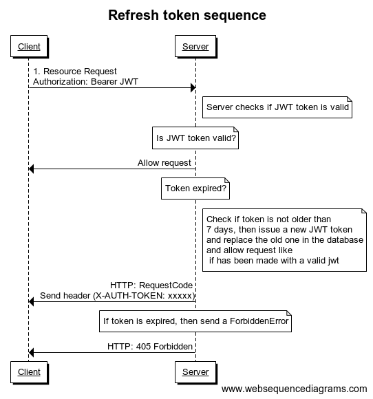

<h1 align="center">
  <br>
  
  <br>
  Mango
  <h4 align="center">TypeScript server template with routing-controllers, typeorm and typedi</h4>
</h1>

<p align="center">  

 <a href="https://opensource.org/licenses/MIT"></a>
</p>

<p align="center">
⚡ Mango is a server template which makes it easy to build backend powered by NodeJS, Express, typeorm, typedi and routing-controllers. It minimises the setup time and makes your development cycle faster by using TypeScript.
  If you were looking for a server template with useful things, Mango is for you 🤗
</p>

<p align="center">
  <a href="#-features">Features</a> •
  <a href="#-how-to-use">How to use</a> •
  <a href="#-structure">Structure</a> •
  <a href="#-changelog">Changelog</a> •
  <a href="#-credits">Credits</a>
</p>

## ⚡ Features

* TypeScript
  - [TypeScript](https://www.typescriptlang.org/) compiles to clean, simple JavaScript code which runs on any browser, in Node.js, or in any JavaScript engine that supports ECMAScript 3 (or newer).
* [TypeORM](https://github.com/typeorm/typeorm)
  - Mango uses TypeORM to map models to your database manager, everything is typed and easier to mantain.
* [TypeDI](https://github.com/typestack/typedi)
  - Mango uses Typedi for dependencies injection
* [routing-controllers](https://github.com/typestack/routing-controllers/)
  - Every controller has it's own file, you declare your routes with annotations and they get registered on server start.
* JWT middleware (there's a refresh token flow, no need to use 2 tokens!)
* Resource activation protection, if a user doesn't own a resource he won't be able to modify it
* Logging, uses [winston](https://github.com/winstonjs/winston), everything gets logged to a file.
* User CRUD and also profile picture upload with [multer](https://github.com/expressjs/multer)
* dotEnv variables
* pm2 ready

And many other features
  
## ❓ How to use

To clone and run this server template, you'll need [Git](https://git-scm.com) and [NodeJS](https://nodejs.org/es/)
MySQL is also needed (or change the database driver in database.ts file, check [TypeORM](https://github.com/typeorm/typeorm) documentation for a how-to)

```bash
# Clone this repository
$ git clone https://github.com/MrARC/Mango

# Go into the repository
$ cd Mango/server

# Install dependencies
$ npm install

# Create .env file
$ cp .example.env .env

# Run the server
$ npm run dev

```

## 👨‍💻 Creating an API response

You may want to use a standard response for all your API calls, you can import the ApiResponse object from ```handlers/api_response.handler``` and create a new instance of it

example:

```typescript
const response = new ApiResponse(response)
            .withData({msg: 'hello'}).withStatusCode(HTTP_STATUS_CODE.OK).build();
```

A request can have the following properties

Method | Description | Note
--- | --- | ---
`.withData(object)` | Anything you want |
`.withStatusCode(HTTP_STATUS_CODE)` | HTTP Status code (see HTTP_STATUS_CODE class) | Defaults to 200
`.build()` | Finish building request | Required to finish building request

## 💥 How to add a new module (controller, service and repo)

Adding a new module it's easy with [plop](https://github.com/amwmedia/plop), just open your console shell, execute:

```bash
npm add:module
```

and follow the steps ✅


## 🔐 Adding authorization or role protection to routes

Adding authorization to a route it's easy, just use the @Authorized annotation and add a roles property (can be an array of roles or a single role (or null if you only want to verify if there's a valid JWT token in request), but there's a weight system in place so users with high role can use routes that are for lower roles)

```typescript
    @Post()
    // use only @Authorized() if you want to verify only jwt token
    @Authorized(RoleType.USER)
    public async blabla(@Res() response: Response, @Body({ required: true }) user: User): Promise<Response> {
      ...
    }
```

## ✅ JWT refresh in Mango

I made a sequence diagram to try to explain this process:



### 🤔 Explanation

Basically there's only one JWT token you will store in the client (web, mobile app, whatever), this JWT token is short-lived (it has a life span of only a few minutes, 15 minutes in production mode), all requests made in that span of time will be passed if the JWT is valid.
If the JWT token is expired, Mango will check if is not older than 1 week and will try to update the old token in database and issue a new JWT token with the new parameters, otherwise it will throw a ForbiddenError  with a 403 status code. The new JWT token will be present in the server response inside a custom header parameter (X-Auth-Token), this parameter will hold your new JWT token for the new requests.

### 📝 Note

You will have to implement some logic on your frontend or mobile app to replace the stored JWT token if the header X-Auth-Token is present in the server response, Mango will refuse to update any already updated JWT token and will throw a UnauthorizedError with a 401 status code.

## 📂 Structure

```text
.
├── CHANGELOG.md
├── docs
├── ecosystem.config.js
├── jest.json
├── LICENSE
├── logs
├── mango.png
├── nodemon.json
├── package.json
├── package-lock.json
├── plopfile.js
├── plop.gif
├── plop-templates
│   ├── controller.hbs
│   ├── repository.hbs
│   └── service.hbs
├── public
│   ├── index.html
│   └── uploads
├── README.md
├── src
│   ├── app
│   │   ├── api
│   │   │   ├── auth
│   │   │   │   ├── auth.controller.ts
│   │   │   │   ├── auth.service.ts
│   │   │   │   ├── jwt_payload.interface.ts
│   │   │   │   ├── token.entity.ts
│   │   │   │   └── token.repository.ts
│   │   │   ├── common
│   │   │   │   ├── CUD.ts
│   │   │   │   └── CUID.ts
│   │   │   ├── health
│   │   │   │   ├── health.controller.ts
│   │   │   │   ├── health.interface.ts
│   │   │   │   └── health.service.ts
│   │   │   ├── index
│   │   │   │   └── index.controller.ts
│   │   │   ├── me
│   │   │   │   └── me.controller.ts
│   │   │   └── users
│   │   │       ├── user.entity.ts
│   │   │       ├── user_profile_picture.entity.ts
│   │   │       ├── user.repository.ts
│   │   │       ├── user_response.interface.ts
│   │   │       ├── user_role.entity.ts
│   │   │       ├── users.controller.ts
│   │   │       └── user.service.ts
│   │   ├── database
│   │   │   ├── database.ts
│   │   │   ├── migrations
│   │   │   └── redis.ts
│   │   ├── decorators
│   │   │   ├── index.ts
│   │   │   └── logger.decorator.ts
│   │   ├── handlers
│   │   │   ├── api_error.handler.ts
│   │   │   └── api_response.handler.ts
│   │   ├── helpers
│   │   │   ├── authorization.helper.ts
│   │   │   ├── current_user.helper.ts
│   │   │   └── index.ts
│   │   ├── lib
│   │   │   └── logger
│   │   │       ├── index.ts
│   │   │       ├── logger.interface.ts
│   │   │       ├── logger.service.ts
│   │   │       └── logger.ts
│   │   ├── middleware
│   │   │   ├── error.middleware.ts
│   │   │   ├── http_logging.middleware.ts
│   │   │   └── not_found.middleware.ts
│   │   └── utils
│   │       ├── index.ts
│   │       ├── json.utils.ts
│   │       └── upload.utils.ts
│   ├── app.ts
│   ├── config
│   │   ├── environments
│   │   │   ├── production.config.json
│   │   │   ├── staging.config.json
│   │   │   └── test.config.json
│   │   ├── globals.ts
│   │   ├── index.ts
│   │   └── setup.ts
│   └── server.ts
├── tests
│   ├── src
│   │   ├── controllers
│   │   │   └── index.controller.spec.ts
│   │   └── setup.ts
│   └── tsconfig.json
├── token_sequence.png
├── tsconfig.json
└── tslint.json

34 directories, 69 files

```

## 📋 ToDo

* [x] Add JWT token refresh
* [x] Better authorization token flow
* [x] Better project structure
* [x] Better readme
* [ ] Create a config file
* [ ] Add docker support
* [ ] Add GraphQL?
* [ ] Add unit test and integration tests (help wanted)

## ✍ Changelog

See:
[Changelog](CHANGELOG.md)

## 🤗 Credits

<div>Icons made by <a href="https://www.freepik.com/" title="Freepik">Freepik</a> from <a href="https://www.flaticon.com/" 			    title="Flaticon">www.flaticon.com</a> is licensed by <a href="http://creativecommons.org/licenses/by/3.0/" title="Creative Commons BY 3.0" target="_blank">CC 3.0 BY</a></div>
